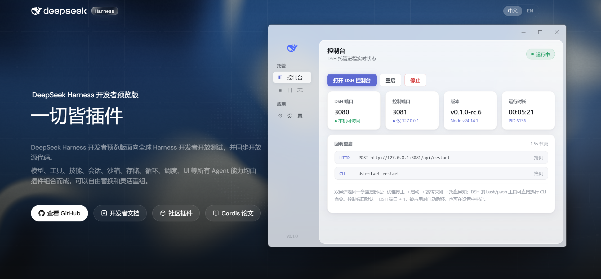

# DSH Start 🐳

> DSH（DeepSeek Harness）的自动安装与自启动托管桌面应用 · 跨平台 · 毛玻璃界面 · 中英双语

**技术栈**: Tauri v2 (Rust) 🦀 + Vue 3 💚 + Vite ⚡ + TypeScript 🔷

**简体中文** · [English](README.en.md)



## ✨ 功能亮点

- 🚀 **一键安装 DSH**：首次运行向导检测环境，确认后把 `@deepseek-ai/dsh` 安装到应用托管目录（不污染全局 npm）；缺少 Node.js 时引导 winget / brew / apt 一键安装
- 🔁 **自启动托管**：「开机启动」登录自动拉起；「崩溃自动重启」意外退出时指数退避重启（最多 5 次）
- 🕵️ **外部实例检测**：你自己在终端跑的 DSH 也能认出来——状态显示「运行中 · 外部实例」，不会误报未运行，也不会抢管
- 📞 **双通道回调重启**（无需用户敲命令，走同一条重启例程）：
  - **HTTP**：`POST http://127.0.0.1:3081/api/restart`（仅本机 + CORS 白名单），`GET /api/status` 查状态
  - **CLI**：注册 `dsh-start restart` 到 PATH，DSH 自己的 bash/pwsh 工具可直接调用，经单实例转发执行
- 🎛️ **控制端口可配置**：默认 = DSH 端口 + 1，被占用自动后移 10 个端口扫描，也可在设置里指定，保存立即重绑——端口冲突不再是事儿
- 🔄 **智能更新**：仅当 npm registry 上确有新版本时才出现「更新到 vX.X.X」按钮
- 🖥️ **托管控制台**：状态卡（端口 / 控制端口 / 版本 / 运行时长）、启动 / 停止 / 重启、实时日志（内存环形 + 滚动文件）
- 🪟 **毛玻璃 UI**：透明亚克力窗口 + Linear 风格双层布局，自定义标题栏，双击最大化
- 🧷 **系统托盘**：左键单击唤出 / 最小化，右键菜单按状态智能启停（外部实例只读不管）；关闭窗口最小化到托盘
- 🌍 **中英双语**：设置页一键切换，界面 + 托盘菜单同步，后续可加更多语言

## 🚀 快速开始（开发）

前置：Node.js 18+、Rust（stable）、各平台 [Tauri 系统依赖](https://v2.tauri.app/start/prerequisites/)

```bash
npm install
npm run tauri:dev
```

打包 📦：

```bash
npm run tauri:build
```

## 📖 使用说明

1. 首次运行进入「安装向导」🧙：检测环境（Node.js / DSH）→ 点击「开始安装 DSH」（不会自动启动）
2. 启动 DSH 两种方式：
   - 勾选「开机启动」：立即启动，以后随系统登录自启
   - 控制台点击「启动 DSH」手动启动
3. 「打开 DSH 控制台」在系统浏览器打开 `http://127.0.0.1:3080`（端口可在设置修改）
4. 关闭窗口 → 最小化到托盘；退出请用托盘菜单「退出」🚪

## 📞 回调重启

| 通道 | 调用方式 | 说明 |
| --- | --- | --- |
| HTTP | `POST http://127.0.0.1:3081/api/restart` | 控制端口默认 = DSH 端口 + 1（可自定义）；仅本机，CORS 仅放行 DSH 网页源 |
| CLI | `dsh-start restart` | 需勾选「注册回调命令」；DSH 的 bash/pwsh 工具可直接执行 |

两者都触发：停止 DSH → 重新启动 → 就绪探测 → 状态事件与托盘通知。1.5s 内重复请求会被节流忽略 ⏱️

## 🗂️ 目录结构

```
src/                Vue 前端（控制台 / 向导 / 日志 / 设置 / i18n）
src-tauri/
  src/
    manager.rs      进程托管：生成 / 监控 / 退避重启 / 就绪探测 / 外部实例探测
    runtime.rs      Node 检测 + 托管 npm install + 版本解析 / 检查更新
    control.rs      127.0.0.1 控制 HTTP 端点（可重绑定 + 端口冲突回退）
    cli.rs          dsh-start restart 回调 shim 与 PATH 注册
    tray.rs         托盘：状态文案 / 双语菜单 / 按状态启停
    commands.rs / settings.rs / logger.rs / state.rs
  tauri.conf.json   窗口（透明亚克力）、打包（NSIS / dmg / deb / appimage）、图标
```

## 🏗️ 跨平台打包

GitHub Actions 三平台构建（`.github/workflows/build.yml`）：push 跑 CI，打 `v*` tag 自动建 Release 草稿。
产物：Windows NSIS 安装包、macOS dmg、Linux deb / AppImage。

## 🔒 安全说明

- 控制端点仅绑定 `127.0.0.1`，CORS 仅放行 `http://127.0.0.1:<DSH端口>` / `http://localhost:<DSH端口>`
- 控制端点 v1 无鉴权，只提供 `status` 与 `restart` 两个动词
- DSH 用户数据（默认 `~/.dsh`，由 `DSH_HOME` 决定）与本应用托管目录分离，本应用只管进程与安装

## 📄 许可证

本项目基于 [Apache License 2.0](LICENSE) 开源。
DSH（DeepSeek Harness）及其相关包遵循其各自的开源许可。
